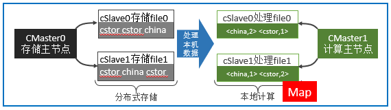
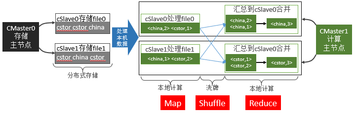
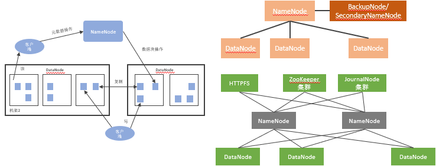
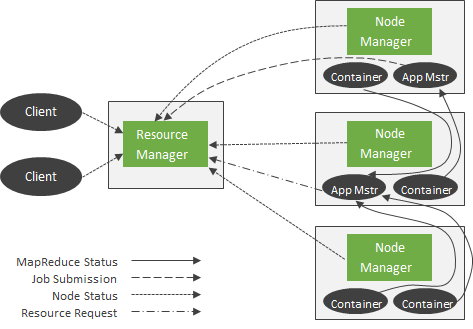
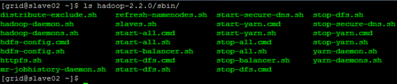
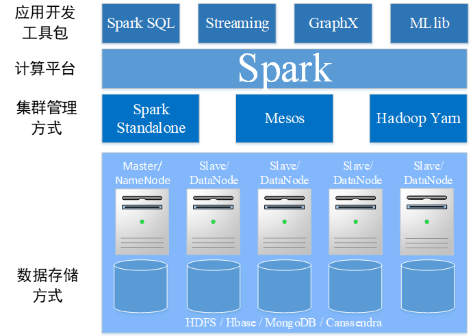

# Hadoop

## 概论

> - 面向数据存储和加工的平台
> - 定义好编程模型和接口
> - 用户编写Application，提交到平台：服务App vs. 运算App
> - 开源，面向数据分析
> - 不一定要在云上：分布式编程模型

### 问题

#### 存储

- 单机容量足够，各机器上的文件要求对外显示它们存于同一硬盘空间；

- 文件大小超出单机容量，要求利用多台机器存入后对外显示依旧为一个完整文件；

#### 计算

> 比如说数单词

#### 可靠性

应对宕机

> 网络开销、利用率、成本

### 分布式解决方案

#### 冗余存储与冗余计算

- 解决可靠性问题——不单纯靠额外增加设备的备份

- 将每台机器上存储的数据同时存于集群中的另一台机器上

- 将每台机器上数据的计算也同时在冗余数据的机器上计算

- `CMaster0`明确知道每一份数据都存储在多个地方

- `CMaster1`会要求存有待计算数据的机器都参与计算，并选择先结束的机器计算结果

冗余存储不仅提高了分布式存储的可靠性，也提高了分布式计算的可靠性。

> 分布式存储和分布式计算可以相互独立存在

#### 分布式存储（Distributed File System, DFS）

将多台机器硬盘以某种方式连接到一起

取机器`cSlave0`，`cSlave1`……和`cMaster0`，采用客户-服务器模式构建分布式存储集群。

让`cMaster0`管理`cSlave0`，`cSlave1`……。

##### 对内：客户-服务器模式

只要保证store master正常工作，我们很容易随意

添加store slave，硬盘存储空间无限大。

##### 对外：统一存储空间，统一文件接口

整个集群就像是一台机器、一片云，硬盘显示为

统一存储空间，文件接口统一。

#### 分布式计算

> “移动计算比移动数据更划算”——Google论文

##### 计算的并行-`Map`

##### 合并的并行-`Reduce`

> 经过洗牌之后，合并的时候分布的文本某一个特定单词的计数都送到某一个节点上进行合并，不同单词之间的合并技术可以并行

### Hadoop简介

#### 渊源

- Apache成立开源搜索引擎项目`Nutch`——但开发过程中无法有效地将计算任务分配到多台机器上

- 前后Google陆续发表`GFS`、`MapReduce`、`BigTable`（谷歌三板斧）

- Apache借鉴GFS和MapReduce，实现了自己的`NDFS`和`MapReduce`

- 发现`Nutch`侧重搜索，而`NDFS`和`MapReduce`偏向通用基础架构，将`NDFS`和`MapReduce`移出`Nutch`，成为独立开发项目，称为`Hadoop`

Hadoop 1.0 （1.X的统称）和Hadoop 2.0 （2.X的统称）架构差异较大。

#### 简介

> 可看作是Google Cloud的开源版本；但并不拘泥于复现Google Cloud的相关产品。
>
> | **Hadoop**        | Google            | 描述           |
> | ----------------- | ----------------- | -------------- |
> | Hadoop  HDFS      | Google  GFS       | 分布式文件系统 |
> | Hadoop  MapReduce | Google  MapReduce | 分布式计算     |
> | HBase             | Google  BigTable  | 分布式数据库   |
> | ZooKeeper         | Google Chubby     | 消息队列       |
> | Pig               | Google  Sawzall   | 脚本语言       |

通过调用程序库，可使用简单的编程模型处理分布在不同机器上的大规模数据。

采用客户-服务器模式，很容易从一台机器扩展至成千上万台机器，每台机器均能提供本地存储和本地计算。

##### Hadoop 1.0

- `Hadoop Common`：支持其他两个模块的公用组件

- `Hadoop DFS`（`HDFS`）：分布式文件系统

- `Hadoop MapReduce`：分布式计算框架

##### Hadoop 2.0

- 分布式操作系统`Yarn`

- `ZooKeeper`：通用的分布式集群的数据管理者

  不仅仅只是为Hadoop服务！集群化思想

  - 统一命名服务
  - 配置管理
  - 集群管理

- `Hbase`：开源分布式数据库

  - 高可靠性

  - 高性能

  - 列存储

  - 可伸缩

  - 实时读写

  **逻辑模型**：用户对数据的组织形式

  `行键、列（<列族>:<限定符>）、时间戳；字节码，无类型`

  **物理模型**：在设备上具体存储形式

  将行按照列族分割存储；逻辑空值无存储

#### 应用领域

##### 构建大型分布式集群（存储+计算）

- 最直接的应用

- 构建大型分布式集群，提供海量存储和计算服务

- 类似产品中国移动“大云”、淘宝“云梯”

##### 数据仓库（存储）

存储半结构化业务数据，通过`Hive`、`Hbase`提供报表查询之类服务

##### 数据挖掘（计算）

- 大数据环境下的数据挖掘思路和算法没有太大变化

- 硬盘性能和内存大小带来的限制——通过分布式集群解决硬件限制

#### 部署方式

传统解压包（繁琐易错）和标准Linux部署方式（简单易用）

> 这里会有一个专门的作业，

> 注意下面均以Hadoop 2.0为基础

## 体系架构

### Common

其他模块的公共组件，定义程序员取得集群服务的编程接口，为其他模块提供共用API。

#### 作用

降低Hadoop设计的复杂性，减少其他模块间耦合性，增强Hadoop健壮性。

#### 功能

- 提供公用API和程序员编程接口（例如Configuration类）；
- 本地Hadoop库（例如压缩解压缩用的是Hadoop本地库）；
- 超级用户superuser；
- 服务级别认证；
- HTTP认证；

### HDFS

高容错、高扩展、高可靠，并提供服务访问接口，如API接口和管理员接口。

#### 体系架构

- 架构：`master`/`slave`；文件分块存储；`namenode`/`datanode`；
- 典型拓扑：一般/商用（`ZooKeeper`选举`ActiveNamenode`，`JourNalNode`两个`Namenode`交换数据）

#### 内部特性

- 冗余备份、副本存放、副本选择、心跳检测

- 数据完整性检测、元数据磁盘失效

- 简单一致性模型、流式数据访问、客户端缓存

- 流水线复制、架构特征、超大规模数据集

#### 对外功能

- `Namenode`==高可靠性==：配置多个`NameNode`，一个失效时立即替换
- `HDFS`快照：当数据损坏时，支持回滚到正确的时间节点
- 元数据管理与恢复工具：通过命令`hdfs oiv`和`hdfs oev`管理修复`fsimage`和`edits`
- `HDFS`安全性：用户和文件级别安全认证、机器和服务级别安全认证
- `HDFS`配额功能：管理目录或文件配额大小
- `HDFS` C语言接口：使用C语言操作HDFS的接口
- `HDFS Short-Circuit`功能：客户端可以绕开`Datanode`直接读取本机数据，加快`Map`操作
- `WebHdfs`：==通过`Web`方式操作`HDFS`==（插、删、改、查）

### Yarn

管理计算机资源、提供用户和程序访问系统资源的API。

- 一个高层的集群管理框架；

- 根据需要的计算类型，定制`ApplicationMaster`；
- 根据需要的调度策略，扩展`Scheduler`

#### 架构

#### 组件详解

1. `Client`：客户端，负责向集群提交作业。

2. `ResourceManager`：集群主进程，仲裁中心，负责集群资源管理和任务调度。

3. `Scheduler`：资源仲裁模块。==纯粹的资源仲裁中心==

4. `ApplicationManager`：选定，启动和==只==监管`ApplicationMaster`。

5. `NodeManager`：集群从进程，管理监视`Containers`，执行具体任务。

6. `Container`：==本机==资源集合体，如某`Container`为4个CPU，8GB内存。

7. `ApplicationMaster`：任务执行和监管中心。==负责任务整体执行==

#### 作业流程

1. 提交作业
2. 任务分配
3. 任务执行
4. 进度和状态更新
5. 任务完成

#### 典型拓扑

#### 核心问题：调度策略

`ResourceManager`的`Scheduler`模块支持插拔，通过配置文件，用户可以个性化指定其调度策略。

##### 自带策略1：容量调度算法`CapacityScheduler`

- 多用户多任务调度策略；
- 以队列为单位划分任务，以Container为单位分配资源；
- 按照配置好的资源配比为不同层级的用户分配最大可用资源；

##### 自带策略2：公平调度算法`FairScheduler`

- 多任务公平使用集群资源的可插拔式调度策略；
- 当资源能够满足所有任务时，则按需分配资源；
- 当资源受限时，会将正在执行的任务释放的资源分配给在等待资源的任务；
- 短任务在合理时间内完成；长任务不至于永远等待；

### MapReduce

编程范式。

`Yarn`中`ApplicationMaster`用来管理任务的执行，其能够管理的任务类型是固定的

通过定义不同类型的`ApplicationMaster`，可以实现管理不同类型的任务。可以将`MapReduce`看作一种类型的计算任务。提供对应的`ApplicationMaster`来管理`MapReduce`任务。

==`ApplicationMaster`和`Scheduler`都是可变的==。

### 拓展

- 在Hadoop框架内定义新的计算任务——编程模板
- 跳出Hadoop的限制——==Spark==——定义更加通用的编程
- 安全机制——不同级别、不同场景的安全认证

## 访问接口

### Web

| 服务        | Web地址                                 | 配置文件          | 配置参数                                  |
| ----------- | --------------------------------------- | ----------------- | ----------------------------------------- |
| `HDFS`      | `http://<NameNodeHostName>:50070`       | `hdfs-site.xml`   | `{dfs.namenode.http-address}`             |
| `Yarn`      | `http://<ResourceManagerHostName>:8088` | `yarn-site.xml`   | `{yarn.resourcemanager.webapp.address}  ` |
| `MapReduce` | `http://<JobHistoryHostName>:19888`     | `mapred-site.xml` | `{mapreduce.jobhistory.webapp.address}`   |

### 命令行

#### HDFS命令

- 以tar包方式部署时，其执行方式是`HADOOP_HOME/bin/hdfs`
- 以完全模式部署时，使用HDFS用户执行`hdfs`即可

#### Yarn命令

- 以tar包方式部署时，其执行方式是`HADOOP_HOME/bin/yarn`
- 以完全模式部署时，使用`Yarn`用户执行`yarn`即可

#### Hadoop命令

- 两种部署方式下分别为`HADOOP_HOME/bin/Hadoop` 和 `hadoop`

#### 其他

- `sbin/`目录下的脚本

  

- 启停服务/管理服务

### 开发接口

#### HDFS编程

- 实例化配置文件 `Configuration conf = new Configuration()`；
- 获取文件系统 `FileSystem hdfs = FileSystem.get(conf)`；
- 使用`hdfs`对象执行文件操作；

> https://hadoop.apache.org/docs/r2.6.4/api/org/apache/hadoop/conf/Configuration.html
>
> 通过configuration传参：`conf.set(key, value)`，`context.getConfiguration().getInt(key)`

#### Yarn编程

- 一套编程协议；
- `Client`负责提交任务，`ApplicationMaster`负责执行任务；
- Client中与RM通信；`ApplicationMaster`与RM通信；`ApplicationMaster`与NM通信
- 编写符合协议的`Client`和`ApplicationMaster`即可

#### 只需考虑MapReduce本身

`Hadoop`默认实现了`MapReduce`的`Client`和`ApplicationMaster`、`MRClientService`和`MRAppMaster`等。

`Yarn`处理MR程序时使用了各种默认的类。

# Spark

## 概论

### 简介

当今大数据领域最活跃、最热门的大数据计算处理框架

- 2009年——诞生于美国加州大学伯克利分校AMP实验室

- 2013年——Spark成为`Apache`基金项目

- 2014年——成为`Apache`基金顶级项目

一体化、多元化的大数据处理体系

- 批处理，`Batch Processing`

- 流处理，`Stream Processing`

- 即席查询，`Adhoc Query`

#### 开发包

`Spark SQL`、`Spark Streaming`、`Spark Mllib`、`Spark GraphX`……

##### `Spark SQL`

- 前身是Shark：基于Hive的Spark SQL，代码量大、复杂，难优化和维护

- 交互式查询、标准访问接口、兼容Hive

- 专门用于处理结构化数据：

- 分布式SQL引擎；在Spark程序中调用API

#### `Spark Streaming`

- 实时对大量数据进行快速处理，处理周期短

- 对数据分段、定义了自动监听更新的框架、提供各种Spark计算函数

##### `Spark GraphX`

- 以图为基础数据结构的算法实现和相关应用

- 使用RDD存储图节点和边信息，提供各种计算函数

##### `Spark MLlib`

- 为解决机器学习开发的库

包括`分类`、`回归`、`聚类`和`协同过滤`等。

> 插曲，`Spark Mllib`的效率被基于`MPI`（`Message Passing Interface`）的机器学习吊打
>
> 可能的解释：https://zhuanlan.zhihu.com/p/81784947

`Spark`==专注于数据的计算==，而==数据的存储==在生产环境中往往还是由Hadoop分布式文件系统==HDFS==承担。

### 优势

#### 对比Hadoop

- 支持多种数据计算需求
  - 流式迭代的类MR计算
  - 图数据结构的计算

- 基于内存的计算范式，不用像Hadoop那样需要不停地写入硬盘（落盘）

> Spark曾经是一个Hadoop应用程序，但是Spark并不一定要依赖于Hadoop

#### 对比MapReduce

Spark是在Hadoop开创的分布式计算框架下对MapReduce编程范式进行扩展的一种更加通用的并行计算框架。

- 独立性更强

- 基于内存：RDD，速度更快；基于内存的计算快100x倍，基于硬盘的快10x倍

- 支持更多数据计算方法：transformation，action等

#### 整体优势

##### **易用**

  支持`Scala`、`Java`、`Python`和`R`等多种编程语言

##### **强大**

  支持`SQL`、`Streaming`、`Graph`和`Machine Learning`等多种应用场景

##### **通用**

  适用于自带的`Standalone`、`Mesos`、`Yarn`等多种不同分布式集群管理框架；

  适用多种不同数据存储方式（数据读取接口丰富）

### 部署模式

#### Local模式

`Local`是方便初学者入门学习和测试用的部署模式

#### Cluster模式

Cluster是真正的集群模式

- `Standalone`集群管理器
- `Yarn`集群管理器
- `Mesos`集群管理器

### 提交模式

`Client`模式和`Cluster`模式

`Local`部署模式只支持`Client`提交模式。

真正的`Cluster`集群部署模式同时支持`Client`和`Cluster`提交模式。

#### Client提交模式

在`worker`节点启动`Driver`程序运行应用程序，结果返回到`Client`端。

#### Cluster提交模式

在`Master`上启动`Driver`程序，结果不会返回给`Client`而是保存在`Master`上。